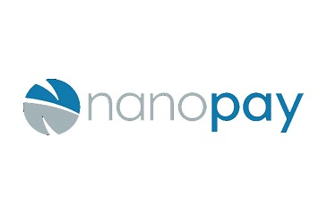
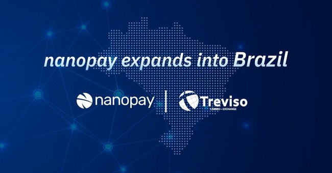
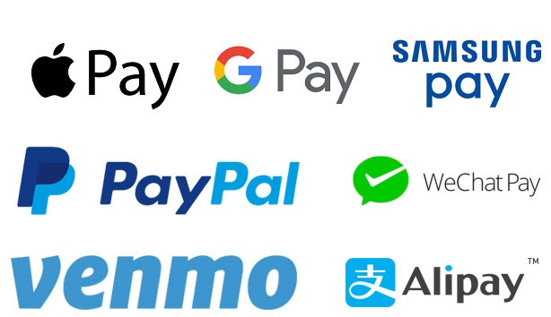

<font size = 4>

# FinTech Case Study

<font size = 3>

## **Nanopay - *"Leading world's transition to digital cash"***


<font size = 3>

## Overview and Origin

<font size = 4>

* Name of company

<font size = 3>

```
    Nanopay 
```
<font size = 4>

* When was the company incorporated?

<font size = 3>

```
    Founded in 2013 [1]
```
<font size = 4>

* Who are the founders of the company? 
 
[1]

<font size = 4>

* How did the idea for the company (or project) come about?

<font size = 3>

```
    "Recognizing a need for change"

    Since the world is changing and evolving very quickly, Laurence Cooke, CEO who founded Nanopay in 2013, left the telecom industry for an area in desperate need of change–payments. His goal was simple. Nanopay's fundamental goal was to deliver simple, reliable and accessible payments to all individual users. [1]

    Once Nanopay established fundamentals, they further enhanced their platform to be more reliable and user-friendly by using "Centralized Ledger Technology" (CLT). Currently, Nanopay provides all individual users payment and liquidity management products for businesses and banks. However, this is just a start. Nanopay will develop technologies and build infrastructure to digitize money for central banks and to create "Central Bank Digital Currency" (CBDC) in the near future. [1]
```
<font size = 4>

* How is the company funded? How much funding have they received?

<font size = 3>

```
    On October 26th 2016, Nanopay announced completion of $10 million in "Series A" funding from the Merchant Banking Division of Goldman Sachs, APAGM Services LLC (Andrew Prozes), Jarnac Capital Management Inc. and Rohatton Inc. [2] Also raised a seed round of $350,000 
```

<font size = 4>

## Business Activities:

* What specific financial problem is the company or project trying to solve?

<font size = 3>

```
    Nanopay currently has 2 big projects going on - Nanopay "Connect" and "Liquid"

    Firstly, Nanopay "Connect" provides a reliable way to connect with the North American payment platform and transfer money and make payments internationally. With a simple automatic bank account verification, it is easy to send or request payments online. It does not stop here. After these transactions, it is possible to monitor and oversee operations. [3]

    One big thing that is attractive is that the company offers low fee for the transaction. While credit cards and wire transfer charge a fee based on the transaction volume, the company provides the service to keep costs low by transfering funds between bank accounts. Furthermore, the company also provides very competitive foreign exchange rates for international payments. [3]

    Secondly, Nanopay "Liquid" provides service in Real-time cash and liquidity management. With its tool, it is possible to manage internal transactions across all business units. In addition to the traditional physical sweeping, pooling and netting, Liquid offers scheduled sweeping with alerts and notifications. Furthermore, it can also provide intercompany loan management service. It is very simple and user-friendly; the company just simply set the terms and this tool automatically calculates the payment amounts with the interest. [4]

    This is not the end. Liquid supports both customers' banks and their corporate clients to define an ideal account hierarchy structure with no additional time or cost to open and close physical accounts. This self-service platform provides an ability to create virtual accounts across various currencies. [4]
```
<font size = 4>

* Who is the company's intended customer?  Is there any information about the market size of this set of customers?


<font size = 3>

```
    As mentioned above, the company provides a secure and reliable way to connect all users with the North American payment platform and transfer money and make payments internationally. With nanoPay technology, it is easy to send or request payments online and also it is possible to oversee operations

    As a result, nanoPay provides this service not only to North America. I would like to share wonderful news that Nanopay revealed to expand into Brazil with "White-Label" international transaction solution. A Brazilian company "Treviso" partners with Nanopay to provide self-service international payments to all their customers and users. Nanopay divided this project into multiple phases. The company will offer remittances to 10 countries in the first phase but the project will be expanded to offer remittances to 150+ different country in the near future.
    [5]
```

<font size = 4>

* What solution does this company offer that their competitors do not or cannot offer? (What is the unfair advantage they utilize?)

<font size = 3>

```
    Nanopay's platform is quite unique. It uses a combination of blockchain and conventional databases and this is called a "hybrid blockchain technology". The conventional blockchain and databases have its advantages and disadvantages. The conventional blockchain technology is secure and provides permanent history of transactions but it is slow and quite costly to transfer and settle securities. However, the traditional databases are efficient, user-friendly and provides low cost. As a result, Nanopay implemented a hybrid technology to provide all users with the only good features of two technologies. Instead of Nanopay's technology is not distributed but is centralized this makes nanopay's technology more secure, fast, and traceable with low cost. 

    According to "Treviso", a self-service portal is not yet available for the users for international payments in Brazil. However, since Nanopay's tool is very reliable and easy to use, it will be very competitive in the market and definitely able to satisfy many customers.

    Another thing here is that it is very hard to find any weakness in Nanopay's ledger. With Nanopay's technology, all transactions are private and indisputable and Nanopay offers so called "state-of-the-art cryptography" to encrypt all data which can provide better security than most banks.
    [5][8]
```

<font size = 4>

* Which technologies are they currently using, and how are they implementing them? (This may take a little bit of sleuthing–– you may want to search the company’s engineering blog or use sites like Stackshare to find this information.)


<font size = 3>

Before I continue, it will be better to explain what "Nanorail" is:
Nanorail is a unique architecture that consists in three different layers - core engine, API, and extensions

```
    As discussed above, Nanopay only adopted the advantages of conventional blockchain and databases to provide reliable and high performance service with low cost to all the customers.

    The company strongly believes that most of financial services will move to a blockchain method which is a distributed ledger technology. However, "nanorail" is a ledger that is built on a cryptographically secure chain of blocks and it is owned by a central authroirty. Therefore, the company currently use this technology called "Centralized Ledger Technology (CLT)" which provides high security, improves speed, and simplifies governance. Also, since nanorail's ledger monitors and tracks each transaction, the users can see the overall status of their accounts with one single touch with minimized lag time.
[6]
```

<font size = 4>

## Landscape:

* What domain of the financial industry is the company in?

<font size = 3>

```
    Payments, billing, and money transfer
```

<font size = 4>

* What have been the major trends and innovations of this domain over the last 5-10 years?

<font size = 3>

```
    There are lots of room for improvement in this domain. However, I would like to focus on 5 areas which many companies in this domain have been emphasized over the last 5-10 years and they also should focus on in order for them to improve themselves and stay more competitive in the next 5-10 years.

    As mentioned before, Nanopay only adopted the advantages of conventional blockchain and databases to provide reliable and high performance service with low cost to all the customers. Therefore, the main focuses were security, consistency & compliance, transactions speed, cost, and simplification of processes.

    Firstly, since many companies in this domain deal with money, security is #1 priority. Luckly, many companies are using a blockchain technology which provides high security and fraud protection which leads to customer satisfaction. Secondly, it is a key to provide high quality consistent level of service that the company promised with customers. Thirdly, transaction is all about the speed. As technology develops, all customers are looking for high speed and better service. Fourthly, low cost is an attractive thing which can lure many customers. Lastly, simplification of process and user-friendly platform/tool is highly necessary in order for them to attract many customers. 

    I strongly believe that without these 5 core things above, it would not be possible to stay competitive in the market. Therefore, many companies in this domain focused on these areas and innovations over the last 5-10 years to be more sucessful.
[15]
```

<font size = 4>

* What are the other major companies in this domain?

<font size = 3>

```
    1) Nordic API Gateway
    2) Arttha
    3) Hypur
    4) Agora Services
    5) PayPal
    6) Apple Pay
    7) Google Pay
    8) Samsung Pay
    9) WeChat Pay
    10) Alipay
    11) Venmo

```

 [9]
 [10]

<font size = 4>

## Results

* What has been the business impact of this company so far?

<font size = 3>

```
    As discussed, the company enhanced the platform to be more reliable and user-friendly by using "Centralized Ledger Technology" (CLT). Currently, Nanopay provides all individual users payment and liquidity management products for businesses and banks. In the near future, Nanopay will develop technologies and build infrastructure to digitize money for central banks and to create "Central Bank Digital Currency" (CBDC).

    The company strongly believes that most of financial services will move to a blockchain method which is a distributed ledger technology. However, "nanorail" is a ledger that is built on a cryptographically secure chain of blocks and it is owned by a central authroirty. Therefore, the company currently use this technology called "Centralized Ledger Technology (CLT)" which provides high security, improves speed, and simplifies governance. Also, since nanorail's ledger monitors and tracks each transaction, the users can see the overall status of their accounts with one single touch with minimized lag time.

    In addition, as mentioned above, Nanopay expanded into Brazil with "White-Label" international transaction solution. "Treviso", a Brazilian company, partners with Nanopay to provide self-service international payments to all its customers. The company will offer remittances to 10 countries in the first phase but the project will be expanded to offer remittances to 150+ different country in the near future.

    Lastly, nanoPay works with Interact to transfer money from Canadian banks to other countries digitally. Their project starts with transferring money to India first as Canadians transfer money frequently to India. With this system, it is easy to transfer funds; all the users need to do is to use the same interac system and simply transfer the fund to eligible banks in India. NanoPay is currently supporting Interact to introduce the service to many users in Canada and possibly expand the service to more countries such as US and UK to be more competitive in the global market. [11]

    As far as I see, nanoPay's technology and business strategy are going to the right path. Although it starts in Canada, the service expands to Brazil. I strongly believe it is just a start. They will stay very competitive in the market if they don't lose their momentum.

[5]
```

<font size = 4>

* What are some of the core metrics that companies in this domain use to measure success? How is your company performing, based on these metrics?

 [10]

<font size = 3>

```
    Typically, every company has KPIs such as Sales Revenue, Net Profit Margin, Gross Margin, Customer loyalty and retention to determine how the company is performing. However, since nanoPay is a start-up company, I would like to touch something different which is company's current technology/capability and the recognition/awards that they received.

    Firstly, nanoPay's platform is running in AWS, which has $100,000 of hardware, can do 3,000 transactions per second." The company is working to demonstrate even higher throughput. The CEO states that he expects to get to the millions of transactions per second in the near future. This is a very good news for the company because this means the company can stay very competitive in the market and it can provide the fastest and the most reliable payments platform to its customers.

    Secondly, we typically don't really think the number of awards received as the core metrics but I strongly believe this will mean a lot to a start-up company like nanoPay. On November 19th 2019, Nanopay named 2019 Blockchain Company of the Year which is a huge achivement for the company. Also, on December 4th 2019, the Fintech Power 50 has launched the 2020 edition of its exclusive annual programme, shining a spotlight on nanopay and those who are transforming financial services for the better. Lastly, on September 11th 2019, CIX Canadian Innovation Exchange announced the CIX TOP 20 Early innovative Canadian technology startups.

[7][12]
```

<font size = 4>

* How is your company performing relative to competitors in the same domain?

<font size = 3>

```
    As mentioned above, NanoPay has developed a mobile payment platform to offer what Apple Pay can offer. However, unfortunately, nanoPay faces challenges now as the company is not as well known as ApplePay, GooglePay, or SamsungPay etc. 

    Although nanoPay has been providing excellent services to its customers, one thing that lacks is that it does not provide customers to purchase products in-store and online. In order for them to be very competitive in the market, they will need to provide the same level of service as their powerful competitors such as ApplePay or GooglePay, where it helps all the customers purchase goods online by using a digital representation of their existing credit cards, debit cards, or gift cards from the devices.
```

<font size = 4>

## Recommendations

* If you were to advise the company, what products or services would you suggest they offer? (This could be something that a competitor offers, or use your imagination!)

<font size = 3>

```
    Since people are mostly into online shopping thesedays, it would be nice for Nanopay to offer what paypal provides, where instead of typing credit card information all the time when making purchases, all users utilize the tool to make payment online. However, I would assume this required lots of effort and time. As mentioned above, this is going to be a challenge for nanoPay because the company is not as well known as Paypal, ApplePay, GooglePay, or SamsungPay etc.

    In my opinion, nanoPay should also focus on a mobile wallet that other strong competitors are focusing on. Interestingly enough, we all know that the technology is changing rapidly and everyone is all about using digital devices. However, the report states that the adoption of the digital wallet was not as successful as we thought. The survey showed that only 6 % of Apple device users who have access to Apple Pay actually used the wallet technology in the U.S. Only 6%! That is surprising but this makes sense because I also still use the physical cards even if I have access to Apply Pay/Wallet.

    It will be a challenge to encouage customers to use their mobile wallets but this can be a great chance for nanoPay since there are still lots of opportunity to grow for mobile wallet market.  
[13]
```

<font size = 4>

* Why do you think that offering this product or service would benefit the company?

<font size = 3>

```
    If the company can provide fast, easy and user friendly payment technology to make payments for online shopping (i.e. Amazon), this will definitely benefit the company. If online purchase is as easy as just one click, a lot of users will use this tool and technology and this can be a good opportunity to expand their business even further. 

    Also, I still believe there are lots of room for growth in the mobile wallet market. Therefore, if nanoPay further develops its technology and if the company is able to sell the advantages of using the mobile wallets, they can be very competitive in the Fintech market and it will be a great opportunity for them to grow exponentially.
```

<font size = 4>

* What technologies would this additional product or service utilize?

<font size = 3>

```
    In order for the company to be more competitive in the market, it will need to benchmark some of the big companies in the market right now. Currently, Apple and Google Pay use near-field(NFC) technology to achieve contactless payments. This means tapping the devices to a compatible terminal and the transaction will be completed. However, Samsung Pay uses not only NFC technology but also uses magnetic secure transmission (MST) technology. This means the device sends a signal that simulates the magnetic strip on a card; therefore, the purchase can be easily made when the devices are in contact with any terminal.  

    As mentioned above, unfortunately, nanoPay faces challenges now as the company is not as well known as ApplePay, GooglePay, or SamsungPay etc. In order for them to be more competitive in the market, they will have to adopt and focus on the some of the new technologies and combine it with what they are good at and what they can provide to the customers.
[14]
```

<font size = 4>

* Why are these technologies appropriate for your solution?

<font size = 3>

```
    These technologies are the ones that other competitive companies have to provide good service to their customers. As mentioned above, in order for them to stay competitive in the market, they will have to develop some of the new technologies and combine it with the ones that they are good at to provide fast and reliable services to the customers.
```
<font size = 4>

## References

<font size = 3>

[1] https://nanopay.net/team/

[2] https://www.globenewswire.com/news-release/2016/10/26/1228349/0/en/nanoPay-Announces-10-Million-in-Series-A-Funding.html

[3] https://nanopay.net/products/connect/

[4] https://nanopay.net/products/liquid/

[5] https://www.prnewswire.com/news-releases/nanopay-expands-into-brazil-with-white-label-international-payment-solution-for-brokers-301057481.html

[6] https://nanopay.net/technology/

[7] https://www.nanopay.net/nanopay-named-2019-blockchain-company-of-the-year/

[8] https://medium.com/@shyamshankar/centralized-ledgers-vs-distributed-ledgers-layman-understanding-52449264ae23

[9] https://craft.co/nanopay/metrics

[10] https://jilt.com/blog/digital-wallets-mobile-conversions/

[11] https://www.borndigital.com/2017/11/30/interac-and-nanopay-partner-to-offer-international-money-transfers

[12] https://www.pymnts.com/startup-check-in/2017/nanopay-security-cross-border-payments/

[13] https://www.ccn.com/canadian-payments-provider-nanopay-faces-competition-cashless-future/

[14] https://www.cnet.com/news/apple-pay-google-pay-samsung-pay-best-mobile-payment-system-compared-nfc/

[15] https://www.currencycloud.com/company/blog/the-five-core-areas-of-b2b-money-transfer-innovation/


## Resources

### FinTech Companies and Domains

For an overview of some of the most successful companies across FinTech domains, check out these resources:

* [Canada has a rosy future in fintech, but obstacles remain, expert says](https://www.cpacanada.ca/en/news/innovation/2019-11-04-canada-fintech-trends)

* [Canadian fintech adoption rate hits 50 per cent, but still trails global peers: EY](https://business.financialpost.com/technology/canadian-fintech-adoption-rate-hits-50-per-cent-but-still-trails-global-peers-ey)

* [The 2019 Canadian fintech market map](https://www.pwc.com/ca/en/industries/technology/canadian-fintech-market-map.html)

* [Canadian Fintech Industry Set to Witness Strong Grow: Report](https://fintechnews.ch/fintech/fintech-canada-report/19783/)

* [Introducing The FinTech Landscape In Canada](http://www.industryandbusiness.ca/development-and-innovation/introducing-the-fintech-landscape-in-canada)

* [Status of the Canadian FinTech Landscape](https://www.cfamontreal.org/static/uploaded/Files/Presentation/19-02-07-David_Nault_Rendez-Vous-Fintech_CFA-Montreal.pdf)

* [The Canadian Fintech Ecosystem Map](https://ecosystem.formfintech.com/)

* [World FinTech Report 2019, Capgemini](https://fintechworldreport.com/)

* [The Most Innovative FinTech Companies in 2019, Forbes](https://www.forbes.com/fintech/2019/#5264de5a2b4c)

* [The Future of FinTech and Banking, Accenture](https://www.accenture.com/us-en/insight-future-fintech-banking)

* [Scanning the FinTech Landscape: 10 Disruptive Models, McKinsey & Company](https://www.mckinsey.com/industries/financial-services/our-insights/banking-matters/scanning-the-fintech-landscape)

### Research Material

As you research your company, you may find these types resources to be useful:

* The company’s website

* The company’s blog

* Company press releases (These can often be found on the Press page of the company's website, or via Google search.)

* Websites of competitors

* FinTech blogs and/or podcasts

* Interviews with the company’s founders, CTOs, or project leads

* Reports devoted to the particular FinTech domain you are focusing on (e.g.,  FinTech in the mortgage industry)

* [Forbes](https://www.forbes.com/fintech/#39ae67bc13f1)

* [McKinsey & Company](https://www.mckinsey.com/featured-insights/fintech)

* [Reuters](https://www.reuters.com/news/archive/RCOMUS_Fintech)

* [TechCrunch](https://techcrunch.com/tag/fintech/)

* [Deloitte](https://www2.deloitte.com/us/en/pages/risk/articles/fintech-trends-insights.html)

* [Built In](https://builtin.com/fintech)

* [FinTech Weekly](https://www.fintechweekly.com/)

* [KPMG](https://home.kpmg/us/en/home/industries/financial-services/fin-tech.html)

* [Stackshare](https://stackshare.io/)

* [Crunchbase](https://www.crunchbase.com/hub/fintech-startups#section-overview)

* [Angelist](https://angel.co/finance-technology)

---

## Submission

* Create a repository for this homework on GitHub.

* Upload the README file containing your case study report to this repository.

* Submit the link to your GitHub repository to Bootcamp Spot.

---
© 2020 Trilogy Education Services, a 2U, Inc. brand. All Rights Reserved.
